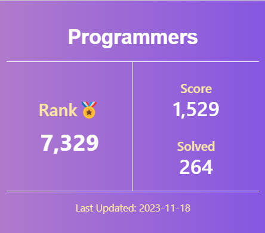

## About Me

    👔 I’m working as a Backend Engineer since July 2021.
    🩷 Things I like: Coffee, Dogs, Solving algorithm problems, Listening to Kpop.
    👝 I’m making a product inventory management system with a friend as a Toy Project.
    💌 How to reach me: choiyh11097@gmail.com

## Skills

#### 📍 My Primary Tech Stack

    

#### 📍 My Additional Skills

       

#### 📍 I Have Experience With

    

